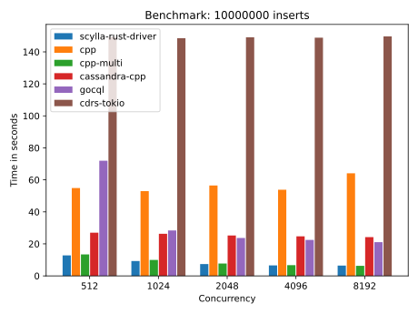

# Rust driver benchmarks
Benchmarks for Scylla Rust Driver

## Benchmarks
* Basic - performs basic operations (inserts/selects), max `concurrency` active requests at once  

## Drivers:
* `scylla-rust-driver` - [Scylla Rust driver](https://github.com/scylladb/scylla-rust-driver)
* `cpp` - [Scylla C++ driver](https://github.com/scylladb/cpp-driver), running on a single thread because multiple threads are [buggy](https://github.com/scylladb/cpp-driver/issues/36)
* `cpp-multi`- [Datastax Cassandra C++ Driver](https://github.com/datastax/cpp-driver), running on multiple threads. The benchmark needs to be optimized further, this driver could have better results.
* `cassandra-cpp` - [Rust bindings for Datastax C++ Driver](https://github.com/datastax/cpp-driver), running on multiple threads using Tokio.
* `gocql` - A [driver written in Go](https://github.com/gocql/gocql)
* `cdrs-tokio` - Another compatible [driver written in Rust](https://github.com/krojew/cdrs-tokio)

## How to run a benchmark
Each benchmark is inside a Docker image  
Build the image and run the benchmark  
Most commands require `sudo` or being in the docker group

For example to run the `basic` benchmark using `scylla-rust-driver`
* Start a local scylla instance: `sudo ./scylla.sh`
* Enter benchmark directory: `cd benchmarks/basic/rust`
* Build the benchmark: `sudo ./build.sh`
* Wait until scylla is ready (Should say something like `listening on 172.17.0.3`)
* Run the benchmark: `sudo ./run.sh`

## How to generate a result chart
Chart generator is also in a docker image for convenience

* Enter the `generate_chart` directory
* Build the docker image: `sudo ./build.sh`
* Enter benchmark results in `config.py`
* Generate the chart: `sudo ./generate.sh`
* Generated chart will be in `chart.png`
