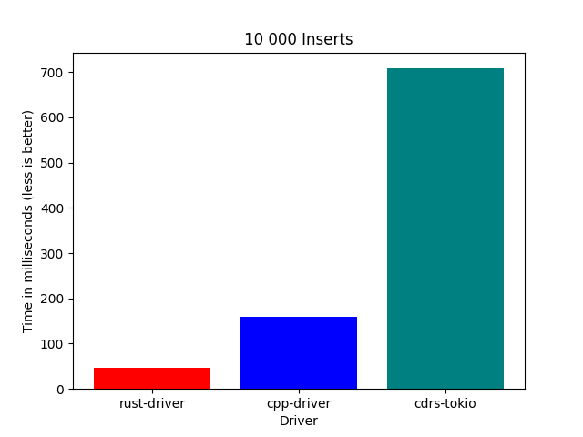

# Rust driver benchmarks
Benchmarks for Scylla Rust Driver

## Benchmarks
* Inserts - performs 10 000 integer inserts
    * scylla-rust-driver: 46ms
    * cpp-driver: 159ms
    * cdrs-tokio: 708ms

## How to run a benchmark
Each benchmark is inside a Docker image
Build the image and run the benchmark
Most commands require `sudo` or being in the docker group

For example to run the `inserts` benchmark using `scylla-rust-driver`
* Start a local scylla instance: `sudo ./scylla.sh`
* Enter benchmark directory: `cd benchmarks/inserts/rust`
* Build the benchmark: `sudo ./build.sh`
* Wait until scylla is ready (Should say something like `listening on 172.17.0.3`)
* Run the benchmark: `sudo ./run.sh`

## How to generate a result chart
Chart generator is also in a docker image for convenience

* Enter the `generate_chart` directory
* Build the docker image: `sudo ./build.sh`
* Enter benchmark results in `config.py`
* Generate the chart: `sudo ./generate.sh`
* Generated chart will be in `chart.png`